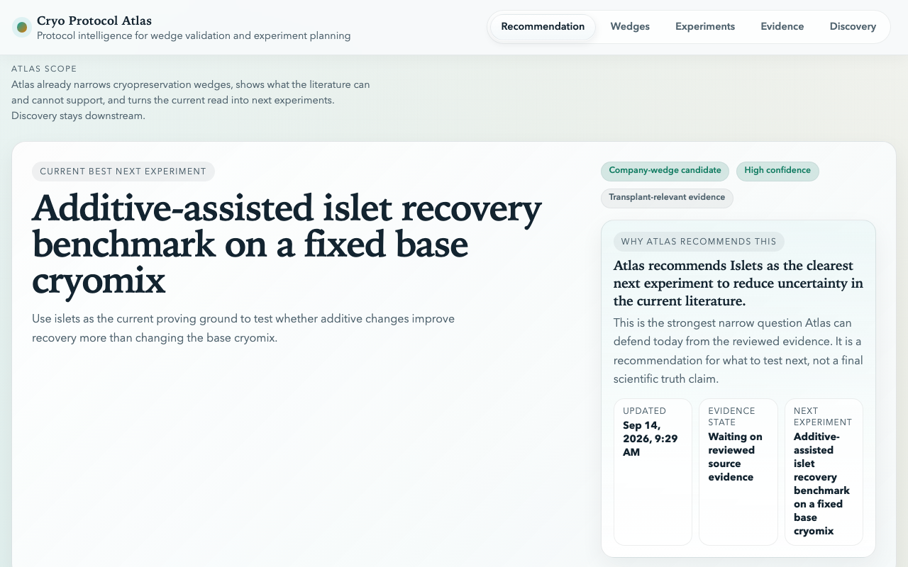

# Cryo Protocol Atlas

Cryo Protocol Atlas reads cryopreservation papers and turns them into structured protocol evidence, then uses that evidence to pick the one experiment most worth running next. It covers two domains, pancreatic islets and ovarian tissue, and stays deliberately conservative about what the literature does and does not support.



Status: built March 2026. The scheduled research loops are off. This is here to read, not a product.

## Who it is for

Anyone trying to answer, for a cryopreservation domain: what is the best current wedge, how strong is the evidence, where are the contradictions, and what should be tested next. That was a scientist, an operator, and an investor when this was written. It is also a worked example of a benchmark-gated literature pipeline if you want to build one.

## What it currently concludes for islets

<!-- Numbers from data/processed/islets/active-wedge.md, data/processed/islets/wedge-benchmark-matrix.md, data/processed/islets/benchmark-summary.json, and data/processed/islets/domain-snapshot.json as of 2026-09-14. -->

Best current wedge: an additive-assisted islet recovery benchmark on a fixed base cryomix. Several islet papers imply that recovery gains come from adjuncts added around a standard DMSO-centered mix rather than from new base CPA chemistry, but nobody has benchmarked those adjuncts head-to-head on one backbone.

Proposed next test: a fixed-backbone additive benchmark with p38 MAPK inhibitor, trehalose, beraprost sodium, and polyvinyl pyrrolidone on a DMSO-centered base mix, with post-thaw function as the primary readout.

Evidence behind that call:

- 3,157 papers fetched from CryoDB, 53 matched to the islets domain, 46 normalized protocols
- 53 benchmark entries, 49 of them human-reviewed; all six reviewed gates pass
- 6 papers directly relevant to the wedge: 2 primary-backed, 2 human-relevant, 4 abstract-only
- strongest signals: polyvinyl pyrrolidone (primary-backed, rat) and a p38 MAPK inhibitor (primary-backed, human)
- evidence confidence 0.79, scientific relevance 0.89, translational potential 0.73

The read is that the literature justifies a focused additive benchmark. It does not justify claiming a winning adjunct.

Ovarian tissue is the comparison domain. Its wedge is a head-to-head DMSO-centered benchmark, but reviewed outcome coverage there is 0.43, so treat it as a proposal rather than a call.

## Truth boundary

Atlas is designed to stay conservative.

- Reviewed evidence is the basis of wedge truth.
- Seeded and abstract-only evidence can inform prioritization, but should not be overread.
- Discovery outputs are additive and downstream.
- LLM-assisted drafting may help triage or prefill structured artifacts, but it does not automatically become reviewed truth.
- Recommendation confidence is always scoped to the current reviewed slice, not experimental validation.

Atlas is not a discovery engine, an autonomous science system, a molecule-design platform, a wet-lab automation platform, or a source of validated biological truth beyond the reviewed slice.

## Run it

Requires Bun 1.2 or newer. All generated artifacts are checked in under `data/`, so the web app and every report script work without network access or API keys.

```bash
bun install
bun run web          # Next.js console at http://localhost:3000
bun run web:build    # production build
```

Rebuild artifacts for a domain (`islets` or `ovarian`):

```bash
bun run ingest:islets        # refresh the corpus from CryoDB (network)
bun run extract:islets       # heuristic protocol extraction with evidence snippets
bun run evaluate:islets      # score against the reviewed benchmark
bun run active-wedge:islets  # pick the wedge
bun run matrix:islets        # wedge benchmark matrix
bun run gap-queue:islets     # ranked evidence gaps
bun run experiments:islets   # next-experiment packets
bun run cycles:islets        # one bounded, benchmark-gated improvement loop
```

Discovery widens the candidate paper set without touching the reviewed slice:

```bash
bun run discover:islets          # query OpenAlex, Crossref, Europe PMC, CryoDB
bun run discover-refresh:all     # full refresh for both domains
bun run validate-discovery-refresh
```

Checks:

```bash
bun run typecheck
bun run test:normalize
bun run test:discovery
bun run test:optimizer
```

Optional environment variables, none needed for the web app or the checked-in artifacts:

- `ANTHROPIC_API_KEY` lets `scripts/validate-llm-enrichment.ts` draft source-enrichment records with Claude. Without it the step is skipped.
- `ENABLE_LLM_AUTO_TRIAGE=true` lets those drafts be applied automatically. Off by default and meant to stay off until the drafts clear an F1 of 0.85 on reviewed records.
- `DISCOVERY_LIVE_PROVIDERS` narrows discovery to a comma-separated subset of `cryodb,openalex,crossref,europe-pmc`.
- `ALLOW_ENRICHMENT_PENDING=true` lets a cycle run while source-enrichment records are still pending review.

## How it works

For each domain:

1. ingest and refresh literature
2. extract protocol evidence into structured artifacts
3. evaluate against the reviewed benchmark
4. select the active wedge
5. build the wedge matrix, evidence gap queue, contradiction report, and experiment packets
6. run a bounded conservative loop to improve the current slice

The question every step serves is: what is the most defensible wedge right now, what blocks conviction, and what should be tested next?

The main outputs per domain live in `data/processed/<domain>/`:

- `active-wedge.{json,md}`: current wedge recommendation
- `wedge-benchmark-matrix.{json,md}`: evidence matrix for that wedge
- `wedge-evidence-gap-queue.{json,md}`: evidence gaps ranked by decision impact
- `experiment-packets.{json,md}`: concrete next experiments
- `wedge-contradiction-report.{json,md}`: contradictions and confounds
- `wedge-brief.{json,md}`: domain strategy summary
- `call-packet.{json,md}`: one-page discussion artifact

`data/processed/opportunity-scan.{json,md}` compares the two domains.

## Layout

- `packages/ingest`: CryoDB client and domain ingest
- `packages/extract`: heuristic title/abstract extraction, optional LLM enrichment drafting
- `packages/normalize`: canonical chemical names, unit parsing, step transitions
- `packages/discovery`: broader literature discovery lane, kept downstream of the reviewed slice
- `packages/optimizer`: a narrow hill-climber whose only mutable target is `packages/optimizer/src/policy.ts`
- `packages/shared`: schemas and shared types
- `packages/research`, `packages/db`: placeholders
- `scripts/`: every `bun run` entrypoint
- `data/`: benchmarks, curated review records, discovery snapshots, processed artifacts, autoresearch run history
- `apps/web`: read-only Next.js console over `data/`
- `docs/`: MVP boundary, canonical protocol plan, web console spec

## Automation

Two GitHub Actions workflows, `autoresearch-cycles` and `discovery-refresh`, run on `workflow_dispatch` only. They used to run on a schedule and commit to `main`; that produced about 250 bot commits between March and September 2026 with no change to either wedge call, so the schedules are off. Trigger them by hand if you want a refresh.

## License

MIT. See `LICENSE`.
